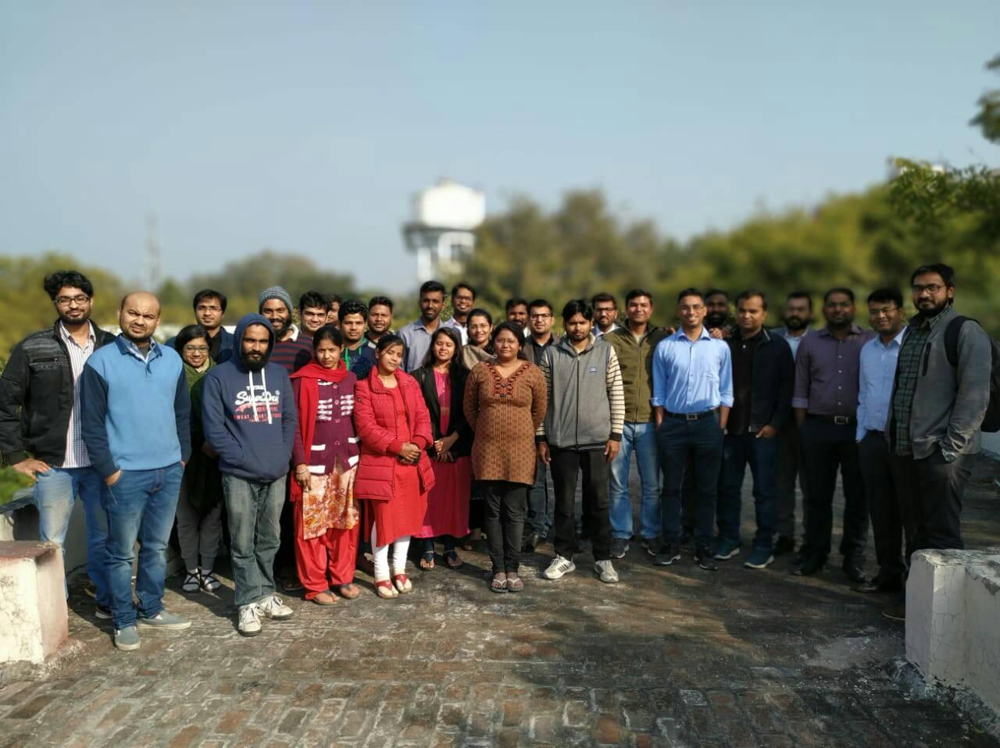

I gave a talk to Indian Administrative Services (IAS) officers as part of their training in January 2019. 
As part of their training, they were visiting IIT Kanpur's incubation center and seeing how the startups are operating there and working on different technologies.
Our startup, Kritsnam, was chosen to give them a talk on IoT and its applications in environmental monitoring.

Here is a group photo after the talk/workshop:

