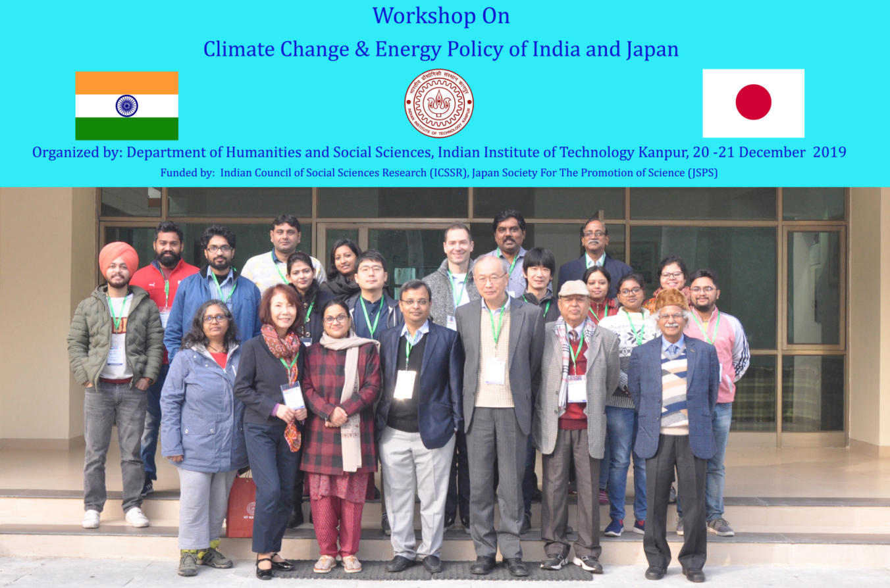

This talk was inspired by my work in solar energy done during my tenure in [Applied Electronics](http://applied.in). Academic experts in *Energy policy* from India and Japan had assembled to discuss the future energy policies of both nations. I, along with my father, were one of the few industry representatives.

My talk discussed about the status of the roof-top solar in India, and how we can make it more efficient. Here is the abstract of the talk:

>  This talk discusses the efficiency problem in the rooftop solar sector in India. While India has a reported rooftop installation capacity of 2.5 GW (as of July 2020), the inefficiency in the various components of the system, brings down this number significantly. Further, this lower efficiency remains blatantly unnoticed and unreported, and is indirectly affecting the popularity of rooftop solar in the Indian consumer mindset leading to a lower share of rooftop solar as compared to ground-mounted solar. In this talk, we first discuss what are the various metrics used for describing the capacity of a solar PV system, and propose a new metric which gives a more realistic view of the capacity. The current popular metrics depict the "input" capacity, while what we need is an "output" capacity, which is what the talk will provide. Finally, we will suggest solutions to increase the efficiency through minor technological tweaks, and demonstrate a full-working system comparing it with the current systems regarding how much efficiency gain it provides.

Here is a group photo from the workshop:

